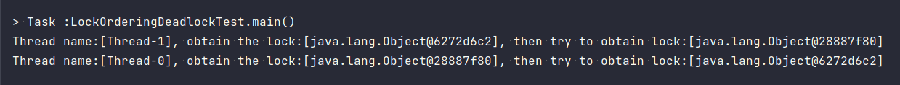
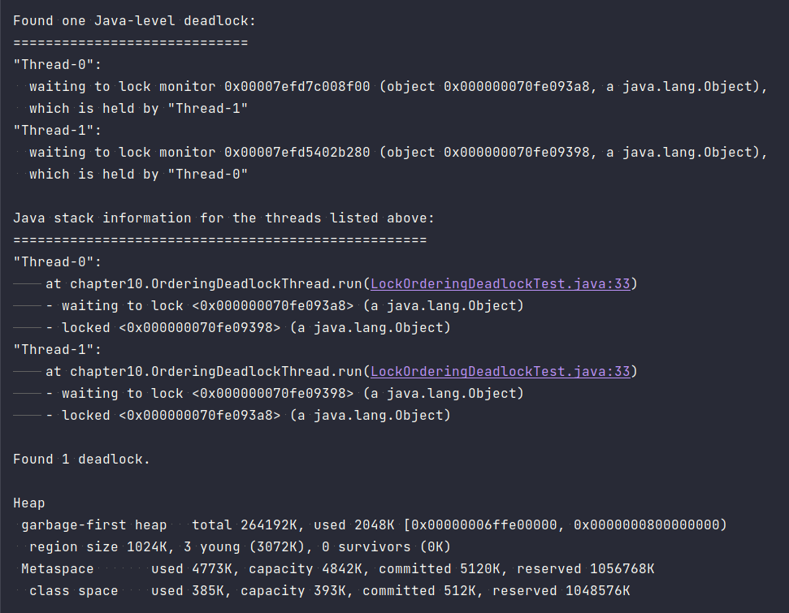
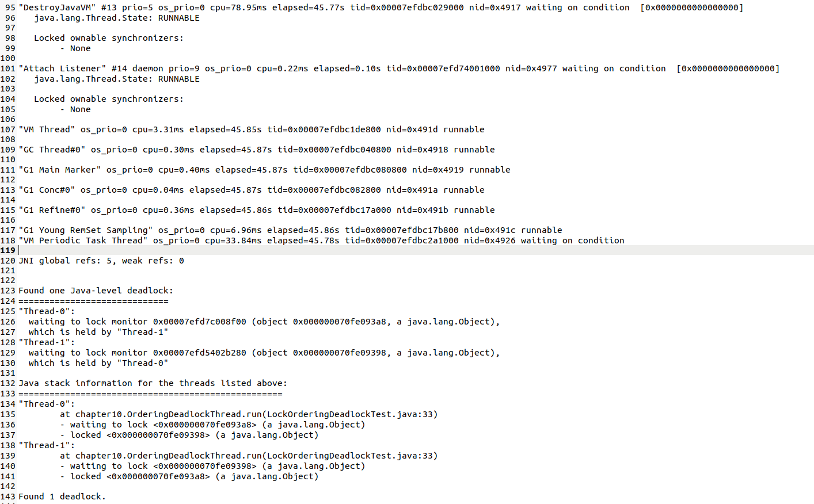
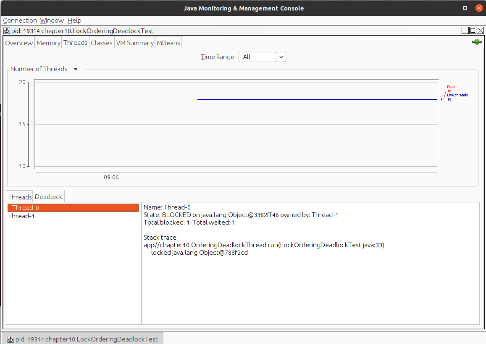
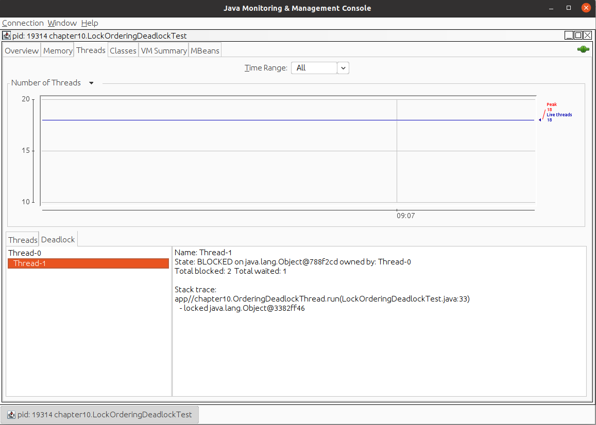

## **Task 008：**

### 任务描述：

- 读完 Chapter 10(page 234)
- 代码实验
  - 目标：写一段代码，演示 `lock-ordering deadlock`
  - 要求：100%概率死锁
  - 重现死锁后
  - 触发 thread dump 并截图
  - 使用 jstack 查看死锁信息并截图
  - 适用 jconsole 查看死锁信息并截图

Deadline：4月13日中午12点

最先完成任务且无明显缺陷的前3名同学将各获得一枚免死金牌 🏅️
指出前三名明显缺陷的同学可以抢得🏅️

使用相对严格模式证实自己的实现比 ConcurrentHashMap性能更好的，可以获得🏅️一枚

------

#### Console Output

#### Thread Dumps

#### Jstack
We can find the whole jstack info in the jstack.out file.

#### Jconsole

